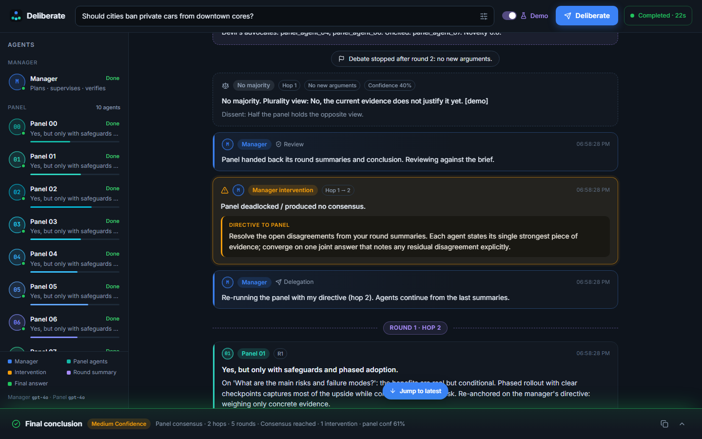

# Manager Agent + 10-Agent Debate Panel (LangGraph)

A multi-agent company. A **manager** (GPT) plans a topic, researches with tools, and delegates to a **panel of 10 identical GPT clones**. The panel debates in rounds, exchanging arguments with citations, until it reaches consensus or a stop rule fires. The manager sees **only per-round summaries plus the surviving conclusion**, never transcripts. It **intervenes only on drift or deadlock**, then returns one **structured final answer**. Debate events stream live.

## Setup

```bash
cd manager-agent
python -m venv .venv
source .venv/bin/activate          # Windows: .venv\Scripts\activate
pip install -r requirements.txt    # optional: pip install e2b-code-interpreter
cp .env.example .env               # Windows: copy .env.example .env
# Edit .env — set OPENAI_API_KEY (required) and TAVILY_API_KEY (recommended)
```

### Environment variables

Keys come only from the environment or `.env`; nothing is hardcoded, and `.env` is gitignored. The manager and panel share `OPENAI_API_KEY`.

| Variable | Default | Purpose |
| --- | --- | --- |
| `OPENAI_API_KEY` | — (**required**) | GPT for the manager and panel. If it is missing, runs fail fast with a clear error (exit 1). |
| `OPENAI_MODEL` | `gpt-4o` | Manager model. |
| `PANEL_MODEL` | *(empty → `OPENAI_MODEL`)* | Model for all 10 panel clones. |
| `TAVILY_API_KEY` | — | `web_search` for the manager and panel. Without it the tool returns a `[placeholder]`. |
| `SEMANTIC_SCHOLAR_API_KEY` | — | Optional; raises S2 rate limits. arXiv and S2 work without a key. |
| `E2B_API_KEY` | — | Panel `code_runner` sandbox (needs `e2b-code-interpreter`). |
| `BROWSER_API_KEY`, `CHROMA_PERSIST_DIR` | — | Reserved for the manager's `browser` / `memory_*` tools (placeholders today). |
| `DOCUMENT_ROOT` | `./data` | `document_reader` / `data_analysis` only read files under this directory. `.env*` files are always refused. |
| `API_CONNECTOR_ALLOWED_ENV_VARS` | — | Env var **names** that `api_connector` may send as auth. Anything else is refused. |
| `MANAGER_MAX_TOOL_STEPS` | 8 | Cap on the manager's tool loop. |
| `MAX_DEBATE_ROUNDS` | 3 | Manager's cap on rounds per panel hop. |
| `MAX_PANEL_HOPS` | 2 | Cap on manager → panel handoffs, including interventions. |
| `PANEL_SIZE` | 10 | Number of clones. |
| `PANEL_MAX_ROUNDS` | 5 | Panel ceiling. The effective ceiling is `min(PANEL_MAX_ROUNDS, MAX_DEBATE_ROUNDS)`. |
| `PANEL_NO_NEW_ARGS_THRESHOLD` | 0.15 | No-new-arguments stop threshold (0–1 novelty). |
| `PANEL_PERSPECTIVE_SHIFT_ROUND` | 2 | Round in which devil's advocates are forced (0 disables). |
| `PANEL_SHIFT_AGENT_IDS` | `panel_agent_03,panel_agent_05` | Agents forced to argue against the majority. |
| `PANEL_CONSENSUS_THRESHOLD` | 0.8 | Share of agents that must back one answer (8/10), plus the engagement gate. |
| `PANEL_RESTATEMENT_THRESHOLD` | 0.6 | Max overlap of a debate argument with the agent's own research note or previous turn. |
| `PANEL_TURN_RETRIES` | 1 | Regenerations for a rejected debate turn before it is accepted and flagged `engagement_failed`. |
| `PANEL_RESEARCH_TOOL_STEPS` / `PANEL_DEBATE_TOOL_STEPS` | 3 / 1 | Per-agent tool-loop caps. |
| `PANEL_MAX_CONCURRENCY` | 5 | Parallel agent LLM calls. |
| `UI_HOST` / `UI_PORT` | `127.0.0.1` / 8000 | Web UI server. |
| `UI_MAX_ACTIVE_RUNS` | 2 | Concurrent UI runs (a run's cost is multiplied accordingly). |
| `UI_DEMO_DELAY` | 1.0 | Demo-mode pacing multiplier (0 = instant). |

## Web UI

A live, color-coded debate board built with FastAPI + SSE and React + Vite. The full guide (palette, components, event contract, build order) is in [`web/README.md`](web/README.md).

```bash
PYTHONPATH=src python -m manager_agent.ui          # API on :8000 (Windows: $env:PYTHONPATH="src")
cd web && npm install && npm run build             # then open http://127.0.0.1:8000
# or, for development: npm run dev → http://localhost:5173
```

Use the **Demo** toggle to watch the real graph run with a scripted model: no API calls, and all content is labelled `[demo]`.



## Run (CLI)

```bash
# Full system: manager + panel, streaming debate events
PYTHONPATH=src python -m manager_agent.main "Does remote work increase productivity?" --stream
# Structured JSON result
PYTHONPATH=src python -m manager_agent.main "..." --json
# Manager only, no-LLM panel stub (cheap)
PYTHONPATH=src python -m manager_agent.main "..." --stub-panel

# Panel solo
PYTHONPATH=src python -m manager_agent.panel "Remote work" \
  --question "Does fully remote work increase productivity?" \
  --sub "What do RCTs find?" --sub "What do firm-level data show?" [--rounds 3] [--json]
```

On Windows PowerShell, set `$env:PYTHONPATH="src"` first. Other options: `--constraints "audience: execs"`.

From Python:

```python
from manager_agent.main import run_manager, stream_manager
from manager_agent.panel import run_panel, stream_panel, run_panel_stub

result = run_manager("topic")                  # FinalAnswer (pydantic)
for event in stream_manager("topic"): ...       # manager steps + panel debate events + final_answer
for event in stream_panel(brief): ...           # solo panel; last event is panel_result
```

### Streamed events

| `type` | Source | Payload |
| --- | --- | --- |
| `manager_step` | manager | `node`, `phase`, plus `plan` / `tool_calls` / `decision`, `verification`, `directive` depending on the node |
| `panel_start` | panel | `hop`, `question`, `agents`, `max_rounds`, `shift_round`, `intervention` |
| `round_start` | panel | `round`, `max_rounds` |
| `agent_turn` | panel | `agent_id`, `round`, `stance`, `argument` (≤400 chars), `citations`, `confidence`, `shifted`, `uncited`; Round 1+ adds `addressed_agents`, `agreements`, `disagreements`, `position_decision`, `stance_delta`, `persuasion_target`, `persuasion_appeal`, `engagement_failed`, `attempts` |
| `perspective_shift` | panel | `round`, `agents`, `opposing`, `trigger` (`scheduled`/`echo`) |
| `round_summary` | panel | `round`, `summary` (the exact string the manager receives), `clusters`, `novelty`, `engagement`, `moved` |
| `research_digest` | panel | `agents`, `count` (all research notes broadcast before Round 1) |
| `turn_rejected` | panel | `agent_id`, `round`, `reasons`, `attempt` (debate turn regenerated) |
| `engagement_gate` | panel | `round`, `passed`, `reasons` (majority blocked as echo) |
| `stop` | panel | `round`, `stop_reason` |
| `consensus` | panel | `status`, `consensus`, `confidence`, `dissent`, `stop_reason`, `rounds` |
| `final_answer` | manager | `result` (`FinalAnswer`) |

`agent_turn` events are meant for the UI. They are never fed to the manager's LLM.

## Architecture

### Manager graph

```
START → intake → plan → agent ⇄ tools → delegate ──→ review ─┬→ synthesize → END
                                          ▲  (run_panel)      │
                                          └──── intervene ────┘   (≤ MAX_PANEL_HOPS)
```

- **intake / plan:** GPT produces a structured `ResearchPlan` (goal, sub-questions, angles, debate rules with `max_rounds` clamped).
- **agent ⇄ tools:** a ReAct loop over the manager's 11 tools, capped.
- **delegate:** builds a `PanelBrief` (topic, goal as the debate question, sub-questions, constraints, directive, prior summaries on intervention) and calls the panel runner. It keeps **only** the round summaries (truncated to `PANEL_SUMMARY_MAX_CHARS`) and the consensus, confidence, stop reason and dissent.
- **review:** stays quiet when the consensus is on track (GPT `DriftCheck`). On deadlock or drift it sends a directive into another hop. It never repeats an identical handoff and stops at the hop cap.
- **synthesize:** GPT → `FinalAnswer`.

### Panel graph (`src/manager_agent/panel/`)

```
START → panel_intake ─┬─ Send ×10 → research_agent ─┐
                      └─ (intervention continuation) ┴→ debate_round
debate_round ─ Send ×10 → debate_agent → summarize_round → check_stop
check_stop ─┬→ debate_round                 (continue)
            └→ settle_consensus → END       (consensus | max_rounds | no_new_arguments)
```

- **Clones:** `make_panel(10)` builds `panel_agent_00 … panel_agent_09` from one prompt template, one tool tuple and one model. Only the id differs. Diversity comes from each agent's **assigned sub-question** (the manager's sub-questions, handed out round-robin), its own retrieval, critique, and the perspective shifter.
- **Research (independent):** each agent runs a short capped ReAct loop with only its own prompt (no peer visibility), then emits a structured `AgentTurn` (stance, argument, citations, new points, self-confidence).
- **Research digest:** once all ten notes land, `broadcast_digest` builds a short form of every note (id, claim, key sources, confidence) and every agent receives it in Round 1.
- **Debate turn (Round 1+):** a structured `DebateTurn` with `addressed_agents` (≥2 peers), `agreements`, `disagreements`, `position_decision` (hold/revise/abandon), `stance_delta`, `persuasion_target` + `persuasion_appeal`, citations and confidence. Round 2+ prompts include every peer's full previous-round argument (`PRIOR_ROUND_ARGUMENTS`); the digest becomes background.
- **Validators (`panel/validators.py`):** a turn is rejected and regenerated once if its argument overlaps its own research note or previous turn (3-word-shingle containment / word Jaccard ≥ `PANEL_RESTATEMENT_THRESHOLD`), if it doesn't name and engage ≥2 real peers (not itself), or if it has no persuasion attempt aimed at an addressed peer. A second failure is accepted but flagged `engagement_failed`.
- **Tracking:** every debate record stores `addressed_agents`, `agreements`, `disagreements`, `evidence_cited`, `position_changed`, `stance_delta` (plus decision, persuasion target, validation failures, attempts). Citations are normalized (`citation`), scored (`source_ranker`), and confidence is calibrated (`confidence_scorer`). Uncited positions are capped at low confidence and flagged to peers as `UNCITED`.
- **Parallelism:** both the research and debate turns fan out with the LangGraph `Send` API, which runs agents in parallel up to `PANEL_MAX_CONCURRENCY`. Each round is *parallel draft, then merge*: every agent sees all peers' previous-round positions, and the summarizer merges them.
- **Short-term memory only:** `PanelState` holds this debate's turns and each agent's own notes. It is reset at intake and never persisted. The panel has no vector DB and no memory tools.

### Debate rules

1. **Open-ended but bounded:** rounds continue until a stop rule fires.
2. **Max-round ceiling:** `min(PANEL_MAX_ROUNDS, manager's max_rounds)`.
3. **No-new-arguments stop:** from round 2, the panel stops if round novelty is below `PANEL_NO_NEW_ARGS_THRESHOLD`. Novelty is the larger of two measures: the share of never-seen citation URLs, or the LLM-judged new arguments per agent.
4. **Consensus:** at least `PANEL_CONSENSUS_THRESHOLD` (8/10) back one answer, **only after** the majority has faced a devil's-advocate round, **and** the engagement gate passes: every majority agent engaged ≥2 peers in some debate round, fewer than 2 agents still restated research in Round 1 after retries, and dissent is documented in the round summary. A majority that fails the gate is treated as echo: no stop, and Panel 03/05 are forced to shift again. At the round limit it settles as `deadlock` with the gate failure written into the dissent, so the manager can intervene. The no-new-arguments stop only fires after a round where engagement held (fewer than 2 failed turns).
5. **Citations required:** uncited claims are flagged, challenged and scored low.
6. **Perspective shift:** in round `PANEL_PERSPECTIVE_SHIFT_ROUND` (after the Round 1 summary), on echo (a unanimous round before any shift), or after an invalid consensus, the agents in `PANEL_SHIFT_AGENT_IDS` (Panel 03 and 05) argue against the majority using the `perspective_shifter` brief, and must still meet every engagement rule.
7. **Manager intervention:** the directive heads every agent's prompt as the new agenda. The next hop continues from the prior summaries, skipping fresh research.

After the stop, `settle_consensus` writes one conclusion from the winning cluster. It returns `status="consensus"` if that cluster meets the threshold, otherwise `"deadlock"` with the plurality conclusion and a note that no majority was reached. Confidence = the cluster's calibrated confidence × (0.5 + 0.5 × support share).

### Summary-only boundary

`PanelResult` has no transcript field. The manager truncates every summary, and panel state updates are filtered out of `stream_manager`. A test puts a marker in every agent argument and asserts it never appears in any manager prompt.

### Observability

Every LLM call is tagged: the manager's with `agent.name`, `agent.role` and `round.index`; the panel's with `agent.id`, `agent.role` and `round.index`. These appear as run metadata in LangSmith or any LangChain tracer. `stop_reason` is logged (`manager_agent.panel` logger) and streamed.

### Cost

Each panel hop makes about 10 × (research steps + 1) + rounds × 10 × (debate steps + 1) + rounds + a few LLM calls. With the defaults and 3 rounds that is **~100 calls per hop**, and the manager allows up to 2 hops. To cut cost, lower `PANEL_*_TOOL_STEPS`, `MAX_DEBATE_ROUNDS` or `PANEL_SIZE`, or use `--stub-panel`.

## Tools

**Manager (11):** `web_search` (Tavily), `academic_search` (S2 + arXiv, keyless), `document_reader`, `data_analysis`, `api_connector` (allowlisted env auth), `planner`, `summarizer` and `fact_checker` (GPT), plus placeholders for `browser`, `code_interpreter` and `memory_store`/`memory_query`.

**Panel (8, identical for every clone):**

| Tool | Implementation |
| --- | --- |
| `web_search` | Shared with the manager (Tavily). |
| `citation` | Normalizes title/url/quote, strips tracking params, returns a stable id and formatted reference. |
| `document_reader` | Shared with the manager (sandboxed to `DOCUMENT_ROOT`). |
| `code_runner` | E2B cloud sandbox. It never runs code locally; it is a placeholder without `E2B_API_KEY`. |
| `source_ranker` | Transparent heuristic: domain credibility tiers (academic/official > news > wiki > blogs/social; no URL = 0.2) × query relevance. |
| `summarizer` | Panel GPT; truncation placeholder without a key. |
| `confidence_scorer` | 0.4 self + 0.25 citations + 0.2 source quality + 0.15 peer agreement → 0–1 score and label. Uncited positions are capped at low. |
| `perspective_shifter` | Panel GPT writes the devil's-advocate brief (opposite thesis, strongest arguments, evidence to seek). |

## Tests

```bash
python -m pytest                                   # offline: fake GPT, no keys, no network
RUN_LIVE=1 python -m pytest tests/test_smoke_live.py -s   # live smoke (costs money)
```

The offline suite has 51 tests. `tests/test_debate_protocol.py` covers the Round 1+ debate rules. `tests/test_ui.py` covers the web API and SSE contract. The rest cover: manager graph, tool caps, sandboxing, 10 identical clones, the panel tool registry (no memory), fail-fast without a key, each stop rule (consensus after the perspective shift, no-new-arguments, max rounds, the manager's round cap), short summaries with no transcript leakage, the research tool loop, per-agent notes, the intervention re-anchor, manager → panel end to end, the manager intervention path end to end, and streaming through the manager.

The live smoke test runs one topic with ≥2 rounds, checks that summaries are shorter than the raw arguments, that a stop rule fires and a consensus is returned, and then does one full manager + panel run. It uses cheap settings (3 rounds, 1 research tool step).

## Layout

```
manager-agent/
├── .env.example  requirements.txt  pyproject.toml  run.sh
├── data/                           # default DOCUMENT_ROOT
├── src/manager_agent/
│   ├── config.py  llm.py  schemas.py  state.py  prompts.py
│   ├── nodes/manager.py            # manager nodes
│   ├── graph.py                    # manager graph (default runner: run_panel)
│   ├── main.py                     # CLI, run_manager(), stream_manager()
│   ├── runtime.py  demo.py         # per-run cancel/demo options; scripted demo brain
│   ├── ui/                         # FastAPI + SSE backend (app, runner, events)
│   ├── tools/                      # manager tools (MANAGER_TOOLS)
│   └── panel/
│       ├── config.py  llm.py       # panel settings + GPT client
│       ├── state.py  schemas.py    # PanelState, AgentTurn, RoundDigest, ConsensusStatement
│       ├── clones.py               # identical clone factory ×10
│       ├── nodes.py  graph.py      # debate cycle; run_panel(), stream_panel()
│       ├── stub.py                 # no-LLM runner
│       ├── __main__.py             # solo CLI
│       └── tools/                  # PANEL_TOOLS (8)
├── web/                            # React + Vite frontend (see web/README.md)
├── docs/screenshots/
├── docs/briefs/                   # the build specs this project follows
└── tests/                          # offline suite + opt-in live smoke
```
