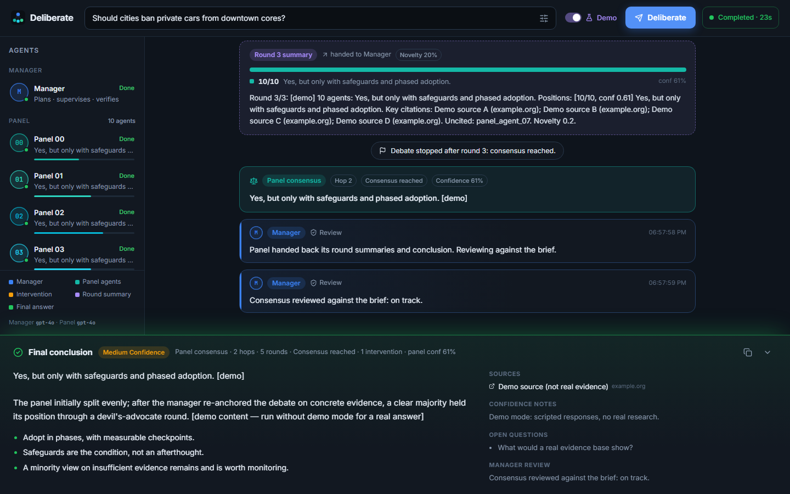

# Deliberate — Web UI

A dark, live debate board for the multi-agent system. You submit a topic. The **real LangGraph manager + panel graph** runs on the server, and the browser receives typed events over Server-Sent Events: manager messages, panel arguments with citations and confidence, round summaries, interventions, and the final answer. No agent logic runs in the browser, and API keys never leave the server.



## Run it

```bash
# 1) API (from manager-agent/)
.venv\Scripts\activate                       # macOS/Linux: source .venv/bin/activate
pip install -r requirements.txt
$env:PYTHONPATH="src"                        # bash: export PYTHONPATH=src
python -m manager_agent.ui                   # FastAPI on UI_HOST:UI_PORT (default 127.0.0.1:8000)

# 2a) Production-style: build once; FastAPI serves it at http://127.0.0.1:8000
cd web && npm install && npm run build

# 2b) Development: hot reload on http://localhost:5173 (proxies /api + SSE to :8000)
cd web && npm install && npm run dev
```

**Demo mode** (the toggle in the top bar) runs the *real* graphs with a scripted model instead of GPT: no API calls, no cost, and every piece of content is labelled `[demo]`. It deliberately deadlocks hop 1 so you can see an amber manager intervention. If the server has no `OPENAI_API_KEY`, the toggle is locked on. `UI_DEMO_DELAY` sets the pacing (0 = instant).

## Project structure

```
manager-agent/
├── src/manager_agent/
│   ├── runtime.py            # per-run options in LangGraph config: cancel_event, demo
│   ├── demo.py               # scripted demo brain (labelled, no network)
│   └── ui/
│       ├── app.py            # FastAPI: /api/* + SSE + serves web/dist
│       ├── runner.py         # RunRegistry: graph in a worker thread → event history → subscribers
│       ├── events.py         # pydantic event contract + Translator (graph events → UI events)
│       └── __main__.py       # python -m manager_agent.ui
├── web/
│   ├── index.html  vite.config.ts  tsconfig.json  package.json
│   ├── public/favicon.svg
│   └── src/
│       ├── main.tsx  App.tsx
│       ├── styles/tokens.css # palette + design tokens (CSS variables)
│       ├── styles/app.css    # component styles, responsive rules, motion
│       ├── lib/types.ts      # event types (mirror of ui/events.py)
│       ├── lib/colors.ts     # agent_id → accent, label, initials
│       ├── lib/runReducer.ts # events → stream items, agent statuses, run phase
│       ├── lib/format.ts
│       ├── hooks/useEventSource.ts   # SSE subscription (+ Last-Event-ID reconnect)
│       ├── hooks/useRunController.ts # POST run / stop, reducer, toasts
│       ├── hooks/useAutoScroll.ts    # follow-bottom, pause on scroll-up, jump to latest
│       └── components/               # see component list
└── tests/test_ui.py          # API + SSE tests (demo brain, offline)
```

## API

| Method | Path | Purpose |
| --- | --- | --- |
| `POST` | `/api/runs` | `{topic, constraints?, demo?}` → `201 {run_id}`. Returns `400` if there is no key and demo is off, `429` above `UI_MAX_ACTIVE_RUNS`. |
| `GET` | `/api/runs/{id}/events` | SSE stream. Each event has an `id:` (= `seq`). Reconnect with `Last-Event-ID` (or `?after=`) and only missed events are replayed. Keepalive every 15 s. |
| `POST` | `/api/runs/{id}/stop` | Cooperative cancel. Every node and every agent turn checks the run's cancel flag. |
| `GET` | `/api/runs/{id}` | Run status. |
| `GET` | `/api/health` | Liveness, whether keys are configured (booleans only), and model names. |
| `GET` | `/api/docs` | OpenAPI UI. |
| `GET` | `/*` | The built SPA (`web/dist`). |

### Event contract

Every event carries `type`, `run_id`, `seq` and `ts`.

| `type` | Fields | Rendered as |
| --- | --- | --- |
| `run_started` | `topic`, `constraints`, `demo`, `agents` | resets board |
| `agent_message` | `agent_id`, `agent_label` (`Manager`, `Panel 00`…`Panel 09`, `System`), `role` (`manager`/`panel`/`system`), `kind` (`plan`/`research`/`handoff`/`review`/`turn`/`shift`/`stop`), `content`, `round_index`, `hop`. Panel turns also carry `stance`, `citations[]`, `confidence`, `shifted`, `uncited` | `MessageBubble` (manager blue / panel teal) or `SystemNote` |
| `manager_intervention` | `content` (directive), `reason`, `round_index`, `hop` | `InterventionCard` (amber) |
| `round_started` | `round_index` (0 = research), `hop`, `label` | `RoundDivider` |
| `round_summary` | `round_index`, `hop`, `summary` (the exact text the manager receives), `clusters[]`, `novelty` | `RoundSummaryCard` (violet) |
| `consensus` | `consensus`, `status`, `confidence`, `stop_reason`, `dissent`, `hop` | `PanelConsensusCard` + chip on the conclusion bar |
| `final_answer` | `content`, `result` (full structured `FinalAnswer`) | `ConclusionPanel` (green) |
| `status` | `agent_id`, `status` (`idle`/`thinking`/`speaking`/`done`/`error`) | sidebar + `TypingIndicator` |
| `error` | `message` | `ErrorToast` |
| `run_finished` | `reason` (`completed`/`cancelled`/`error`) | run chip + conclusion placeholder |

The live board shows per-agent arguments. The manager's LLM still receives **summaries only**; that boundary is enforced in the graph, not the UI.

## Color palette

All colors are CSS variables in `src/styles/tokens.css`.

| Token | Hex | Role |
| --- | --- | --- |
| `--bg` | `#0B0F14` | App background |
| `--bg-elevated` | `#121821` | Sidebar, cards, input chrome |
| `--bg-stream` | `#0E141C` | Debate stream |
| `--border` | `#1E2A38` | Dividers, card outlines |
| `--text` / `--text-muted` | `#E7EEF7` / `#8B9BB0` | Primary / secondary text |
| `--accent` | `#3B82F6` | Primary button, focus ring |
| `--manager` | `#3B82F6` blue | Manager badge, bubble bar, avatar |
| `--panel` | `#14B8A6` teal | Panel accents, consensus card |
| `--intervene` | `#F59E0B` amber | Manager intervention card |
| `--summary` | `#A78BFA` violet | Round dividers, summary cards, devil's-advocate tag |
| `--final` | `#22C55E` green | Final conclusion border/glow, done status |
| `--error` | `#EF4444` | Errors, Stop, uncited tag |
| `--thinking` | `#64748B` | Thinking pulse |

The panel agents each get their own accent, all from the teal family:

| Agent | 00 | 01 | 02 | 03 | 04 | 05 | 06 | 07 | 08 | 09 |
| --- | --- | --- | --- | --- | --- | --- | --- | --- | --- | --- |
| Accent | `#14B8A6` | `#2DD4BF` | `#06B6D4` | `#22D3EE` | `#38BDF8` | `#60A5FA` | `#818CF8` | `#34D399` | `#4ADE80` | `#5EEAD4` |

The brief listed Panel 09 as `#2DD4BF`, the same as Panel 01. I changed it to `#5EEAD4` so every badge is distinct.

**Card rules:** cards use the elevated surface with a 1px border and a 3px left accent bar in the role or agent color. Badges are pills with the label on a 16% tint of that color. Interventions have an amber border, halo and warning icon. Round summaries get a violet dashed divider plus a dashed violet card. The final conclusion has a green top border and an upward glow, and is pinned at the bottom.

## Components

| Component | Responsibility |
| --- | --- |
| `AppShell` | Grid: top bar / sidebar + stream / conclusion. Below 1024px the sidebar becomes a drawer with a backdrop. |
| `TopicBar` | Topic (Enter to submit), optional constraints, demo toggle, Deliberate / Stop, run status chip with elapsed time |
| `AgentSidebar` | Manager + Panel 00–09, active count, color legend, model names |
| `AgentStatusItem` | Avatar with status dot, label, status pill (thinking pulse, speaking bars, done, error; the manager shows "Supervising"), latest stance and confidence bar |
| `Avatar` | Initials in an accent ring. Rings pulse while thinking. |
| `DebateStream` | Scroll container: empty state with example topics, skeletons while starting, event → component mapping |
| `RoundDivider` | Violet dashed "Round N · Hop H" rule (and "Research") |
| `MessageBubble` | Card + badge + kind/round tags + timestamp. Panel cards add stance, argument, citation chips, confidence meter, and Devil's advocate / Uncited tags. |
| `InterventionCard` | Amber card: reason plus the directive sent to the panel |
| `RoundSummaryCard` | Violet card: position split bar, cluster legend, novelty, the manager-facing summary |
| `PanelConsensusCard` | Each hop's panel conclusion (teal), or "No majority" (muted) |
| `SystemNote` | Centered pill for perspective shifts and stop reasons |
| `TypingIndicator` | Stacked avatars + "Panel 03, Panel 05 and 6 others are thinking…" + dots |
| `ConclusionPanel` | Placeholder states (ready / waiting · round / stopped / failed), then the final answer: key points, sources, confidence notes, open questions, manager review, copy, collapse |
| `JumpToLatestButton` | Appears when you scroll up; counts unseen events |
| `ErrorToast` | Dismissible, auto-hiding error toasts |
| `useEventSource` | EventSource lifecycle; reconnect state; closes on `run_finished` |
| `useRunController` | POST run and stop, reducer wiring, toasts |
| `useAutoScroll` | Smooth follow. Only a user scroll-up pauses it; it resumes at the bottom and keeps up when the viewport shrinks. |

## Build order and done criteria

| # | Step | Done when | Status |
| --- | --- | --- | --- |
| 1 | Palette + tokens | All role/agent colors are CSS variables in `tokens.css`, documented above | ✅ |
| 2 | Event schema | `ui/events.py` pydantic models ↔ `lib/types.ts` | ✅ |
| 3 | Runner + FastAPI SSE | `POST /runs`, SSE events, stop, health; replay on reconnect | ✅ `tests/test_ui.py` |
| 4 | AppShell layout | Topic bar top, sidebar left, stream center, conclusion bottom | ✅ |
| 5 | Presentational components | Bubbles, intervention, summary, divider, typing, status item in the right colors | ✅ |
| 6 | TopicBar + useRunController | Submit starts a run; Stop cancels it (run ends `cancelled`) | ✅ |
| 7 | useEventSource + DebateStream | Live events render; smooth follow; jump-to-latest when scrolled up | ✅ |
| 8 | Sidebar status wiring | thinking → speaking → done per agent; typing indicator | ✅ |
| 9 | ConclusionPanel | Pinned green panel on `final_answer` | ✅ |
| 10 | Instrument graph emits | Manager / panel / summary / intervention / status events come from the real graph (`stream_manager`) | ✅ |
| 11 | Responsive pass | Drawer below 1024px; wrapped top bar below 720px; no horizontal scroll at 390px | ✅ |
| 12 | Loading / empty / error states | Empty hero, skeletons, spinners, toasts, stopped/failed placeholders | ✅ |
| 13 | README | This file | ✅ |
| 14 | Smoke test | One topic shows labelled colored bubbles, round divider + summary, amber intervention, green conclusion | ✅ demo mode, headless Chromium; ⏳ live GPT run needs a key |

## Tests

```bash
python -m pytest tests/test_ui.py     # 9 tests: health (no secret leak), 400/422/429/404, full SSE contract,
                                      # Last-Event-ID replay, stop → cancelled, translator mapping
cd web && npm run typecheck           # strict TypeScript
```
